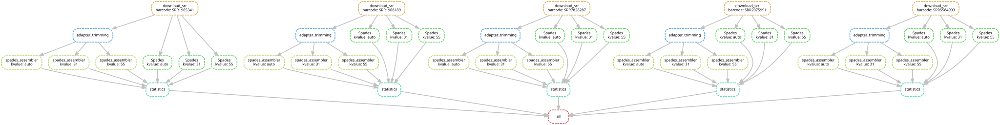
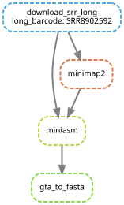
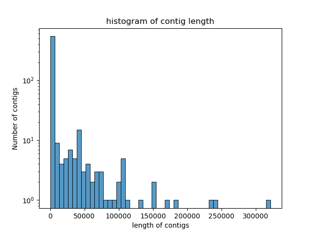

# Genomics pipeline for reproducible data analysis of Salmonella enterica genomes - Bioinformatics Practical Course
## Day 4: 
[TOC]
## Table of Contents
## Sheet 1:Genome Assembly
### Task 1: About Salmonella

Salmonella enterica is a highly diverse Gram negative bacterial species. A few S.enterica serovars includongy Typhi, Paratyphi A, B or C are highly adapted to the human host as their reservoir. They are the casuative agents of enteric fever(also known as typhoid fever or paratyphoid fever). Enteric fever is an invasive, life-threatening, systemic disease resulting more deaths. It is endemic in developing world in regions that lack water nad adequate sanitation, faciliating the spread of these pathogens via the faecal-oral route. 

Source: https://www.frontiersin.org/articles/10.3389/fmicb.2014.00391/full

### Overview of workflow of short reads barcode



### Overview of workflow of long read barcode


### Task 2 and 3: Pipelining and Improving the assembly

#### creating the conda environment
 * environment.yml witth content:
``` 
channels:
        - bioconda
        - conda-forge
dependencies:
        - snakemake-minimal
        - sra-tools
        - SPAdes
```
 * conda environment 
```
conda env create -n salmonella-pipeline -f environment.yaml
```
 * activate the environment 
```
conda activate salmonella-pipeline
```
 * check installation:
```
snakemake --help
```

### Using sra-tools to download the sequencing data with the barcode (SRR1965341) from the SRA 
* first rule of sra-tools download
```
configfile: "config.yaml"
rule all:
    input:
      expand("/data/short-reads/{barcode}_1.fastq",barcode=config["barcode"]),
      expand("/data/short-reads/{barcode}_2.fastq",barcode=config["barcode"])
rule download_srr:
    output:
      "/data/short-reads/{barcode}_1.fastq",
      "/data/short-reads/{barcode}_2.fastq"
    threads: 6
    shell:
      """fastq-dump --split-files {wildcards.barcode} -O /data/short-reads/"""

```
* fasterq-dump helps to download the data from SRA and split the paired files automatically into forward and reverse reads. 
* configfile is "config.yaml" which contains the barcode (SRR1965341). And the config file is used in input for both {barcode}_1 and {barcode}_2 of rule all.
* to split and save the files into two separate files, --split-files parameter is used.
* Output files are: {barcode}_1.fastq, {barcode}_2.fastq 
* to specify the output directory, -O parameter is used.
* Threads: 6
 
## Day 5:

### **SPAdes assembly**
* config.yaml
```
barcode:["SRR1965341"]
kvalue:["31","55"]
```
* snakefile

```
configfile: "config.yaml"
rule all:
    input:
      #expand("/data/short-reads/{barcode}_1.fastq",barcode=config["barcode"]),
      #expand("/data/short-reads/{barcode}_2.fastq",barcode=config["barcode"])
      expand("/data/spades_assembled/{barcode}/k_{kvalue}/contigs.fasta",barcode=config["barcode"],kvalue=config["kvalue"])
rule download_srr:
    output:
      "/data/short-reads/{barcode}_1.fastq",
      "/data/short-reads/{barcode}_2.fastq"
    log: 
      "logs/short-reads/{barcode}.log"
    threads: 4
    shell:
      """fastq-dump --split-files  {wildcards.barcode} -O /data/short-reads/"""

rule Spades:
    input:
      forward_p = "/data/short-reads/{barcode}_1.fastq",
      reverse_p = "/data/short-reads/{barcode}_2.fastq"
    output:
      "/data/spades_assembled/{barcode}/k_{kvalue}/contigs.fasta"
    log: 
      "logs/Spades_assembled/{barcode}/k_{kvalue}/spades.log"
    params:
      kmer = "{kvalue}"
    threads: 4
    shell:
      """spades.py -k {params.kmer} -t {threads} --pe1-1 {input.forward_p} --pe1-2 {input.reverse_p} -o /data/spades_assembled/{wildcards.barcode}/k_{wildcards.kvalue}"""
```
* input files are from the output of rule download_srr, i.e SRR1965341_1. fastq and SRR1965341_2.fastq
* output files are /data/spades_assembled/{barcode}/k_31/contigs.fasta and /data/spades_assembled/{barcode}/k_55/contigs.fasta
* parameter are k-value ["31","55"]
* threads: 4
* parameter --pe1-1 PATH is for path to forward reads
* parameter --pe1-2 PATH is  for path to reverse reads
* -k INT is for k-values 
* -t is for number of threads
* -o is for output directory. 
* the assembly should be run with two different values for k (the k-mer size), therefore producing one contigs file per k value
* Note: -e parameter is not used in fastq-dump.(failure execution because it doesnot contain -e parameter for threads)
* ` Barcode: ["SRR1965341","SRR1968189","SRR7828287","SRR2075991","SRR5584993"]` : 4 new Barcodes were added
* And ` kvalue: ["auto","31","55"]` were added.
* And start the screen session:` screen -S salmonella-pipeline`
* activate conda environment:` conda activate salmonella-pipeline`
* run the pipeline:` snakemake --cores 4`
* interrupt the execution of pipeline: Ctrl+C
* unlock the screen: snakemake --unlock
* start with only one barcode 
* and k-value ["auto","31","55"] was used and only auto of k_value of 1 barcode was pushed to git. I delete the spades_assembled and short-reads of logs. Now only k_auto of 1 barcode was created??????
* attach (re-enter) session: screen -x or screen -r salmonella-pipeline
* run pipeline: snakemake --cores 4
* detach session when the analysis is finish: press Ctrl+a, d

## Day 6:Monday(27.09.2021)

### **Task 6: Adapter trimming**
* adapter. fasta was available on Teams
* adapter_1.fasta and adapter_2.fasta were created.
* add cutadapt in environment.yml for trimming:
```
channels:
        - bioconda
        - conda-forge
dependencies:
        - snakemake-minimal=6.8.0
        - sra-tools=2.11.0
        - SPAdes=3.15.3
        - cutadapt=3.4
```
* install cutadapt automatically: conda env update --file environment.yml --prune
* activate conda environment: conda activate salmonella-pipeline
* snakefile
```
expand("/data/trimmed/{barcode}_1.fastq",barcode=config["barcode"]),
expand("/data/trimmed/{barcode}_2.fastq",barcode=config["barcode"]),
expand("/data/spades_assembled/{barcode}_trimmed/k_{kvalue}/contigs.fasta",barcode=config["barcode"],kvalue=config["kvalue"])
```
* These are added in the rule of all to trim the barcode with the help pf adapter. 
 
```
rule adapter_trimming:
    input:
      "/data/short-reads/{barcode}_1.fastq",
      "/data/short-reads/{barcode}_2.fastq"
    output:
      "/data/trimmed/{barcode}_1.fastq", 
      "/data/trimmed/{barcode}_2.fastq" 
    threads: 4
    shell:
      "cutadapt -a file:adapter_1.fasta -A file:adapter_2.fasta -o /data/trimmed/{wildcards.barcode}_1.fastq -p /data/trimmed/{wildcards.barcode}_2.fastq "
      "/data/short-reads/{wildcards.barcode}_1.fastq /data/short-reads/{wildcards.barcode}_2.fastq -j 0"

rule spades_assembler:
    input:
      left="/data/trimmed/{barcode}_1.fastq",
      right="/data/trimmed/{barcode}_2.fastq"
    output:
      "/data/spades_assembled/{barcode}_trimmed/k_{kvalue}/contigs.fasta"
    threads: 4
    shell:
      "spades.py --pe1-1 {input.left} --pe1-2 {input.right} "
      "-o /data/spades_assembled/{wildcards.barcode}_trimmed/k_{wildcards.kvalue} -k {wildcards.kvalue} -t 4"

```
* rule adapter_trimming and spades_assembler were added beneath the rules of spades. Changed the barcode of rule of spades into {barcode}_untrimmed to specify the wildcards.
* `expand("/data/spades_assembled/{barcode}_trimmed/k_{kvalue}/contigs.fasta",barcode=config["barcode"],kvalue=config["kvalue"])` was added in rule of all. 
* input files from trimming: from /data/short-reads/{barcode}_1.fastq and from /data/short-reads/{barcode}_2.fastq
* output files: "/data/trimmed/{barcode}_1.fastq" and "/data/trimmed/{barcode}_2.fastq"
* parameter:` -a PATH`: adapter.fasta forward file and ` -A PATH`: adapter.fasta reverse file
* `-o`: output of forward fasta file and `-p`: output of reverse fasta file
* `-j 0` : automatically selects the available threads 

### **Task 7**
* ` Barcode: ["SRR1965341","SRR1968189","SRR7828287","SRR2075991","SRR5584993"]` : 4 new Barcodes were added in config.yaml
* And start the screen session:` screen -S salmonella-pipeline `
* run the pipeline:` snakemake --cores 4 `

## Day 7: Tuesday
* To check if all the assemblies of trimmed and untrimmed with different parameters were completed or not, this command has been used.
```
ls -la /data/spades_assembled/*/*/contigs.fasta
```
- if the contigs files exists, the assembly was completed. It was shown like below as a result. And every assembly of trimmed and untrimmed of every barcode with every parameters were existed.
```
-rw-r--r-- 1 root root 5086604 Sep 27 15:38 /data/spades_assembled/SRR1965341_trimmed/k_31/contigs.fasta 
-rw-r--r-- 1 root root 5067565 Sep 27 15:54 /data/spades_assembled/SRR1965341_trimmed/k_55/contigs.fasta 
-rw-r--r-- 1 root root 5067136 Sep 27 15:22 /data/spades_assembled/SRR1965341_trimmed/k_auto/contigs.fasta
-rw-r--r-- 1 root root 5153904 Sep 24 13:31 /data/spades_assembled/SRR1965341_untrimmed/k_31/contigs.fasta 
-rw-r--r-- 1 root root 5085537 Sep 24 14:16 /data/spades_assembled/SRR1965341_untrimmed/k_55/contigs.fasta 
-rw-r--r-- 1 root root 5085101 Sep 24 18:21 /data/spades_assembled/SRR1965341_untrimmed/k_auto/contigs.fasta 
```

###  **Task 4: Assembly statistics**
*  creating biopython script to collect the following statistics about the read data assemblies:
   * average read length
   * average contig length
   * total number of contigs
   * shortest contigs
   * longest contigs
   * N50 of all contigs
   * N50 of all contigs longer than 300 bp
* **installation of biopython in conda environment**
  * include `biopython=1.79` to ` environment.yml` file under dependencies.
  * update conda environment: `conda env update --file environment.yaml --prune`
  * check installation: `conda list`

**Calculation of assembly statistics**
* bioscript: `statistics_assembly.py`(tried but couldnot create python script, so I have to take from others)
```

from Bio import SeqIO
from shutil import copyfile
import os
import math

LISTAveragecontigs=[]  #average contig length
LISTtotalcontigs=[]    #total number of contigs
LISTshortestcontigs=[] #shortest contigs
LISTlongestcontigs=[]  #longest contigs
LISTN50 =[]            #N50 contigs
LISTBP300N50=[]        #N50 of all contigs longer than 300 bp
pathList= []           # list with input paths
for inputpath in snakemake.input:
    pathList.append(inputpath)
    shortestcontigs = 100000000
    longestcontigs = 0
    Numbercontigs = 0
    Totallengthcontigs = 0
    Totallength300contigs = 0
    #calculate average contig length, total number of contigs, shortest contigs and longest contigs
    for record in SeqIO.parse(inputpath, "fasta"):
        Numbercontigs += 1
        num = len(record)
        Totallengthcontigs += num
        if (num > 300):
            Totallength300contigs += num
        if (num < shortestcontigs):
            shortestcontigs = num
        if (num > longestcontigs):
            longestcontigs = num

    Averagecontigs = Totallengthcontigs/Numbercontigs

    N50 = 0
    N50_sum = 0

    N50_BP300 = 0
    N50_sum_BP300 = 0
    #calculate N50
    for record in SeqIO.parse(inputpath, "fasta"):
        num = len(record)
        if (N50_sum < Totallengthcontigs/2):
            N50_sum += num
            if (N50_sum >= Totallengthcontigs/2):
                N50 = num
        if (N50_sum_BP300 < Totallength300contigs/2): #calculate N50 for contigs longer than 300 bp
            N50_sum_BP300 += num
            if (N50_sum_BP300 >= Totallength300contigs/2):
                N50_BP300 = num


    #append lists with calculated values
    LISTAveragecontigs.append(Averagecontigs)
    LISTtotalcontigs.append(Numbercontigs)
    LISTshortestcontigs.append(shortestcontigs)
    LISTlongestcontigs.append(longestcontigs)
    LISTN50.append(N50)
    LISTBP300N50.append(N50_BP300)


print("Total no. of contigs",LISTtotalcontigs)
print("Average contigs:",LISTAveragecontigs)
print("shortest contigs:", LISTshortestcontigs)
print("longest contigs:",LISTlongestcontigs)
print("N50 of all contigs:", LISTN50)
print("N50 of all contigs longer than 300 BP:", LISTBP300N50)

#calculate best assembly
BESTN50 = LISTN50.index(max(LISTN50))
bestpath = pathList[BESTN50]

#copy contig.fasta of best result into separate folder
copypath = "/data/bestAssembly/" + str(snakemake.wildcards)

os.makedirs(copypath, exist_ok = True)
copypath = copypath + "/contigs.fasta"
copyfile(bestpath, copypath)

#create new file with overview of results
with open(snakemake.output[0], "w") as result:
    result.write("best assembly is in :" + bestpath)
    result.write("\nshortest contig:")
    for out in LISTshortestcontigs:
        result.write(str(out)+"\t")
    result.write("\nlongest contig:")
    for out in LISTlongestcontigs:
        result.write(str(out)+"\t")
    result.write("\nnumber of contigs: ")
    for out in LISTtotalcontigs:
        result.write(str(out) + "\t")
    result.write ("\navg contig length; ")
    for out in LISTAveragecontigs:
        result.write(str(out)+"\t")
    result.write("\nN50 of all contigs: ")
    for out in LISTN50:
        result.write(str(out)+"\t")
    result.write("\nN50 of contigs longer than 300 bp:")
    for out in LISTBP300N50:
        result.write(str(out)+"\t")
```
## Day 8(Wednesday):

### **Assembly statistics**(continued)
* The biopython script was integrated by adding a new rule named rule statistics into the snakefile.
```
rule statistics:
    input:
      expand("/data/spades_assembled/{{barcode}}_trimmed/k_{kvalue}/contigs.fasta",kvalue=config["kvalue"]),
      expand("/data/spades_assembled/{{barcode}}_untrimmed/k_{kvalue}/contigs.fasta",kvalue=config["kvalue"])
    output:
      "statistics/statistics_{barcode}.txt",
      "/data/bestAssembly/{barcode}/contigs.fasta"
    script: 
      "statistics_assembly.py"
``` 
```
expand("statistics/statistics_{barcode}.txt",barcode=config["barcode"]),
expand("/data/bestAssembly/{barcode}/contigs.fasta",barcode=config["barcode"])
```
* These are added in the rule of all.
*  


* best evaluated assembly by N50 value is marked for further processing.
* Best assembly:First choose the assembly with highest N50 value, if they are same choose the assembly with the longest contig.
N50 for all contigs and N50 for contigs larger than 300kb do not really differ for assemblies with overall small contigs. -> Reason: By sorting from big to small, only the length of the whole assembly differs.
 The N50 for contigs larger 300kb can be equal or larger compared to the N50 for all contigs. The N50 is a very important measure to assess the quality of an assembly and thus is used for this evaluation. Since about half of the genome sequence can be covered by contigs at least of the N50 contig size, it is preferable to have high N50 values.
```
best assembly is in :/data/spades_assembled/SRR1965341_trimmed/k_auto/contigs.fasta
shortest contig:56	32	56	56	32	56	
longest contig:322089	321983	322089	322089	321983	322089	
number of contigs: 170	622	175	315	1492	321	
avg contig length; 29283.141176470588	8009.13344051447	28447.85714285714	15843.787301587301	3363.1139410187666	15548.29906542056	
N50 of all contigs: 147418	92982	110300	147418	96827	110300	
N50 of contigs longer than 300 bp:147418	92982	110300	147418	103861	110300	
```
* Best assembly of every barcode can be seen with statistics as shown above.
### **Task 5: Assembly statistics plots**
* histogram of contig lengths for single assemblies
  * **installation of matplotlib in conda environment**
    * include `matplotlib=3.4.3` to  `environment.yml` file under dependencies.
    * update conda environment:` conda env update --file environment.yaml --prune`
    * check installation: `conda list`
 * bioscript: histogram_plot.py
```
import matplotlib.pyplot as plt
from Bio import SeqIO
import pandas as pd
import seaborn as sns

lengthcontigs = []
with open(snakemake.input[0]) as handle:
    for archive in SeqIO.parse(handle,"fasta"):
        read = int(archive.id.split("_")[3])
        lengthcontigs.append(read)

plot=pd.DataFrame(lengthcontigs, columns = ["lengthcontigs"])
histog = sns.histplot(data=plot, x="lengthcontigs", bins=50)
histog.set(xlabel= "length of contigs")
histog.set(ylabel = "Number of contigs")
histog.set(title ="histogram of contig length")
plt.yscale("log")
plt.savefig(snakemake.output[0])
```
* The bioscript is integrated into snakefile by adding the new rule 
```
rule histogram_plot:
    input:
      "/data/spades_assembled/{barcode}_{adapter}/k_{kvalue}/contigs.fasta"
    output:
      "plots/histogram/{barcode}_{adapter}_k_{kvalue}.png"
    threads: 4
    script:
      "histogram_plot.py"
```
* The command line as mentioned below was added in the rule of all. 
```
expand("plots/histogram/{barcode}_{adapter}_k_{kvalue}.png",barcode=config["barcode"],kvalue=config["kvalue"],adapter=ADAPTER)
```

*  The plots as shown above were created for every assembly(trimmed and untrimmed) with different k values(auto, k_31, k_55)..
### **Task 9**
* Use assembly-stats to get the statistics of the assemblies
```
 conda activate assembly-stats
```
* need the contigs.fasta to do analysis
```
assembly-stats -s /data/spades_assembled/SRR1965341_trimmed/k_31/contigs.fasta
```

```
/data/spades_assembled/SRR1965341_trimmed/k_31/contigs.fasta    total_length    4981681
/data/spades_assembled/SRR1965341_trimmed/k_31/contigs.fasta    number  622 
/data/spades_assembled/SRR1965341_trimmed/k_31/contigs.fasta    mean_length     8009.13                                                                                                                            /data/spades_assembled/SRR1965341_trimmed/k_31/contigs.fasta    longest 321983                                                                                                                                     /data/spades_assembled/SRR1965341_trimmed/k_31/contigs.fasta    shortest        32                                                                                                                                 /data/spades_assembled/SRR1965341_trimmed/k_31/contigs.fasta    N_count 0                                                                                                                                          /data/spades_assembled/SRR1965341_trimmed/k_31/contigs.fasta    Gaps    0                                                                                                                                          /data/spades_assembled/SRR1965341_trimmed/k_31/contigs.fasta    n10     239815                                                                                                                                     /data/spades_assembled/SRR1965341_trimmed/k_31/contigs.fasta    n10n    2                                                                                                                                          /data/spades_assembled/SRR1965341_trimmed/k_31/contigs.fasta    n20     172047                                                                                                                                     /data/spades_assembled/SRR1965341_trimmed/k_31/contigs.fasta    n20n    5                                                                                                                                          /data/spades_assembled/SRR1965341_trimmed/k_31/contigs.fasta    n30     134561                                                                                                                                     /data/spades_assembled/SRR1965341_trimmed/k_31/contigs.fasta    n30n    8                                                                                                                                          /data/spades_assembled/SRR1965341_trimmed/k_31/contigs.fasta    n40     106117                                                                                                                                     /data/spades_assembled/SRR1965341_trimmed/k_31/contigs.fasta    n40n    12                                                                                                                                         /data/spades_assembled/SRR1965341_trimmed/k_31/contigs.fasta    n50     92982                                                                                                                                      /data/spades_assembled/SRR1965341_trimmed/k_31/contigs.fasta    n50n    17                                                                                                                                         /data/spades_assembled/SRR1965341_trimmed/k_31/contigs.fasta    n60     67697                                                                                                                                      /data/spades_assembled/SRR1965341_trimmed/k_31/contigs.fasta    n60n    24                                                                                                                                         /data/spades_assembled/SRR1965341_trimmed/k_31/contigs.fasta    n70     51495                                                                                                                                      /data/spades_assembled/SRR1965341_trimmed/k_31/contigs.fasta    n70n    32                                                                                                                                         /data/spades_assembled/SRR1965341_trimmed/k_31/contigs.fasta    n80     41397                                                                                                                                      /data/spades_assembled/SRR1965341_trimmed/k_31/contigs.fasta    n80n    44                                                                                                                                         /data/spades_assembled/SRR1965341_trimmed/k_31/contigs.fasta    n90     30122                                                                                                                                      /data/spades_assembled/SRR1965341_trimmed/k_31/contigs.fasta    n90n    57 

```
* This is the result of the command above.
* save all the files in .txt files to the directory `mkdir assembly_stats`.
  *` assembly-stats -s /data/assembled/SRR1965341/k_31/contigs.fasta > ./assembly_stats/stats_SRR1965341_k_31.txt`
* Statistics of /data/assembled/SRR1965341/k_31/contigs.fasta is saved in ./assembly_stats/ as "stats_SRR1965341_k_31.txt"
* This files are now in the folder assembly_stats:
```
stats_SRR1965341_trimmed_k_31.txt      stats_SRR1968189_trimmed_k_31.txt      stats_SRR2075991_trimmed_k_31.txt      stats_SRR5584993_trimmed_k_31.txt      stats_SRR7828287_trimmed_k_31.txt                      stats_SRR1965341_trimmed_k_55.txt      stats_SRR1968189_trimmed_k_55.txt      stats_SRR2075991_trimmed_k_55.txt      stats_SRR5584993_trimmed_k_55.txt      stats_SRR7828287_trimmed_k_55.txt                      stats_SRR1965341_trimmed_k_auto.txt    stats_SRR1968189_trimmed_k_auto.txt    stats_SRR2075991_trimmed_k_auto.txt    stats_SRR5584993_trimmed_k_auto.txt    stats_SRR7828287_trimmed_k_auto.txt                    stats_SRR1965341_untrimmed_k_31.txt    stats_SRR1968189_untrimmed_k_31.txt    stats_SRR2075991_untrimmed_k_31.txt    stats_SRR5584993_untrimmed_k_31.txt    stats_SRR7828287_untrimmed_k_31.txt                    stats_SRR1965341_untrimmed_k_55.txt    stats_SRR1968189_untrimmed_k_55.txt    stats_SRR2075991_untrimmed_k_55.txt    stats_SRR5584993_untrimmed_k_55.txt    stats_SRR7828287_untrimmed_k_55.txt                    stats_SRR1965341_untrimmed_k_auto.txt  stats_SRR1968189_untrimmed_k_auto.txt  stats_SRR2075991_untrimmed_k_auto.txt  stats_SRR5584993_untrimmed_k_auto.txt  stats_SRR7828287_untrimmed_k_auto.txt  
```
## Day 9: Thursday
### **Task 8: Long read sequencing**
* include `minimap2` and `miniasm` to  `environment.yml` file under dependencies. 
* update conda environment:` conda env update --file environment.yaml --prune`
* check installation: `conda list`
* add the barcode SRR8902592 in config.yaml
```
long_barcode:["SRR8902592"]
```
* add the rule of download_srr_long in snakefile to download SRA and convert it to fastq file
```
rule download_srr_long:
    output:
      "/data/long-reads/{long_barcode}.fastq"
    threads: 4
    log:
      "logs/long-reads/{long_barcode}.log"
    shell:
      """(fastq-dump {wildcards.long_barcode} -O /data/long-reads/) > {log}"""
```
* add these in rule of all 
```
expand("/data/long-reads/{long_barcode}.fastq",long_barcode=config["long_barcode"])

```
* add the rule of minimap2 in snakefile to compute the overlap of reads
```
rule minimap2:
    input:
      "/data/long-reads/{long_barcode}.fastq"
    output:
      "/data/long_read_assembly/{long_barcode}.paf.gz"
    log:
      "logs/minimap2/{long_barcode}.log"
    shell:
      """minimap2 -x ava-ont -t8 {input} {input} | gzip -1 > {output}"""
```
* parameter -x ava-ont for nanopore reads and -x ava-pb for PacBio reads
* add these in rule of all
```
expand("/data/long_read_assembly/{long_barcode}.paf.gz",long_barcode=config["long_barcode"]),
```
* add the rule of miniasm in snakefile to compute gfa using overlapped long reads using miniasm
```
rule miniasm:
    input:
      paf="/data/long_read_assembly/{long_barcode}.paf.gz",
      fastq="/data/long-reads/{long_barcode}.fastq"
    output:
      "/data/long_read_assembly/{long_barcode}.gfa"
    log:
      "logs/miniasm/{long_barcode}.log"
    shell:
      """miniasm -f {input.fastq} {input.paf} > {output}"""
```
* add these in rule of all.
```
expand("/data/long_read_assembly/{long_barcode}.gfa",long_barcode=config["long_barcode"])
```
* add the rule of gfa to fasta to convert the gfa file to fasta file in snakefile
```
rule gfa_to_fasta:
    input:
      "/data/long_read_assembly/{long_barcode}.gfa"
    output:
      "/data/long_read_assembly/{long_barcode}/contigs.fasta"
    log:
      "logs/fasta/{long_barcode}.log"
    shell:
      """awk '/^S/{{print \">\"$2"\\n\"$3}}' {input} | fold > {output}"""
```
* add these in rule of all.
```
expand("/data/long_read_assembly/{long_barcode}/contigs.fasta",long_barcode=config["long_barcode"])
```
### **Task 9: assembly-stats**
* add the rule assembly_stats_short to get the assembly statistics of short reads.
```
rule assembly_stats_short:
    input:
      short_in="/data/bestAssembly/{barcode}/contigs.fasta"
    output:
      short_out="assembly-statistik/short-reads/{barcode}.txt"
    shell:
      """assembly-stats {input.short_in} > {output.short_out}"""
```
* add the command in the rule of all.
```
expand("assembly-statistik/short-reads/{barcode}.txt",barcode=config["barcode"])
```
* add the rule assembly_stats_long to get the assembly statistics of long reads.
```
rule assembly_stats_long:
    input: 
      long_in="/data/long_read_assembly/{long_barcode}/contigs.fasta"
    output:
      long_out="assembly-statistik/long-reads/{long_barcode}.txt"
    shell:
      """assembly-stats {input.long_in} > {output.long_out}"""

```
* add the command in the rule of all.
```
expand("assembly-statistik/long-reads/{long_barcode}.txt",long_barcode=config["long_barcode"])
```
* The result as .txt file of bestAssembly of short-reads barcode SRR1965341 as shown below:
```
stats for /data/bestAssembly/SRR1965341/contigs.fasta
sum = 4978134, n = 170, ave = 29283.14, largest = 322089
N50 = 147418, n = 13
N60 = 107509, n = 17
N70 = 83945, n = 23
N80 = 64964, n = 29
N90 = 41750, n = 39
N100 = 56, n = 170
N_count = 0
Gaps = 0
```
* The result as .txt file of bestAssembly of long read barcode SRR8902592 as shoen below:
```
stats for /data/long_read_assembly/SRR8902592/contigs.fasta
sum = 5984934, n = 148, ave = 40438.74, largest = 4870332
N50 = 4870332, n = 1
N60 = 4870332, n = 1
N70 = 4870332, n = 1
N80 = 4870332, n = 1
N90 = 5347, n = 22
N100 = 3229, n = 148
N_count = 0
Gaps = 0
```
## Sheet 2: Comparative genomics
### Task 1: Genome annotation
* install the conda environment with prokka and roary
* `conda install -c conda-forge -c bioconda -c defaults prokka`
* `conda install -c bioconda perl-bioperl=1.7.2`
* `conda create -n roary_ perl=5.22 prokka`
* `conda install -c bioconda roary``
* `export PERL5LIB=$CONDA_PREFIX/lib/perl5/site_perl/5.22.0/`
* `conda install -c bioconda perl-file-find-rule=0.34=2`
* creating new snakemake file called 'Snakefile' and add the rule prokka_short and rule all as shown below along with configfile and bestAssembly as input.
```
configfile: "config.yaml"
rule all:
    input:
      expand("/data/prokka/short-reads/{barcode}.txt",barcode=config["barcode"]),
      expand("/data/prokka/short-reads/{barcode}.gff",barcode=config["barcode"])
rule prokka_short:
    input:
      "/data/bestAssembly/{barcode}/contigs.fasta"
    output:
      "/data/prokka/short-reads/{barcode}.txt",
      "/data/prokka/short-reads/{barcode}.gff"
    threads: 4
    shell:
      """prokka -O /data/prokka/short-reads/ --force --prefix {wildcards.barcode} --cpus {threads}  {input}"""
```

* Information of about coding sequences of SRR1965341.txt
```
organism: Genus species strain                                                                                                                                                                                     contigs: 170                                                                                                                                                                                                       bases: 4978134                                                                                                                                                                                                     CDS: 4678                                                                                                                                                                                                          rRNA: 3                                                                                                                                                                                                            repeat_region: 3                                                                                                                                                                                                   tRNA: 59                                                                                                                                                                                                           tmRNA: 1   
```
* Information of about coding sequences of SRR1968189.txt
```
organism: Genus species strain                                                                                                                                                                                     contigs: 236                                                                                                                                                                                                       bases: 4965782                                                                                                                                                                                                     CDS: 4711                                                                                                                                                                                                          rRNA: 4                                                                                                                                                                                                            repeat_region: 4                                                                                                                                                                                                   tRNA: 60                                                                                                                                                                                                           tmRNA: 1 
```
* Information of about coding sequences of  SRR2075991.txt
```

organism: Genus species strain                                                                                                                                                                                     contigs: 183                                                                                                                                                                                                       bases: 5287431                                                                                                                                                                                                     CDS: 5027                                                                                                                                                                                                          rRNA: 10                                                                                                                                                                                                           repeat_region: 3                                                                                                                                                                                                   tRNA: 87                                                                                                                                                                                                           tmRNA: 1 
```
* Information of about coding sequences of SRR5584993.txt
```
organism: Genus species strain                                                                                                                                                                                     contigs: 275                                                                                                                                                                                                       bases: 5165385                                                                                                                                                                                                     CDS: 4891                                                                                                                                                                                                          rRNA: 3                                                                                                                                                                                                            repeat_region: 3                                                                                                                                                                                                   tRNA: 59                                                                                                                                                                                                           tmRNA: 1  
```
* Information of about coding sequences of  SRR7828287.txt
```
organism: Genus species strain                                                                                                                                                                                     contigs: 194                                                                                                                                                                                                       bases: 4972777                                                                                                                                                                                                     CDS: 4702                                                                                                                                                                                                          rRNA: 3                                                                                                                                                                                                            repeat_region: 3                                                                                                                                                                                                   tRNA: 59                                                                                                                                                                                                           tmRNA: 1 
```
* install canu to correct long reads but rule of correct_long_reads isnot working well.
* tried to build DAG of previous workflow but there is an error.
> Building DAG of jobs...  
> MissingRuleException: 
> No rule to produce /data/prokka/short-reads (if you use input functions make sure that they don't raise unexpected exceptions). 
